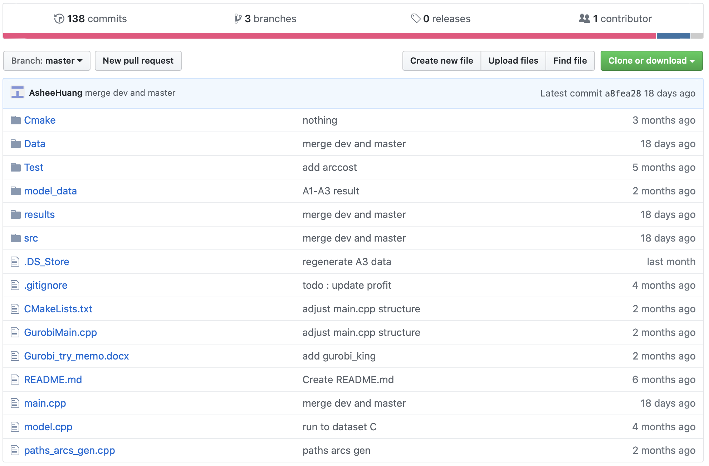
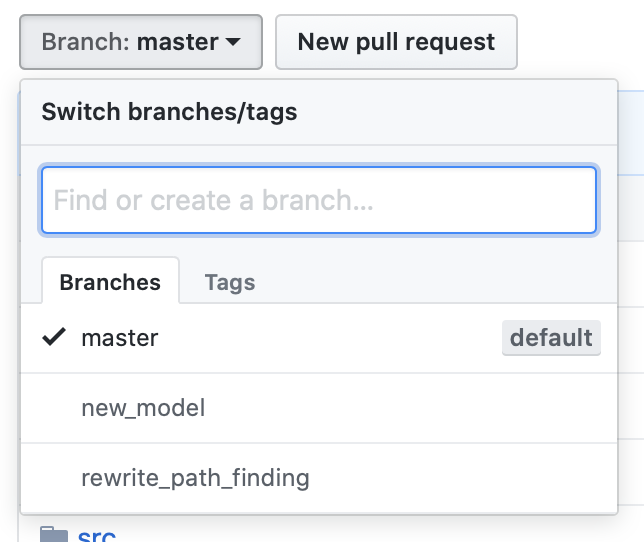
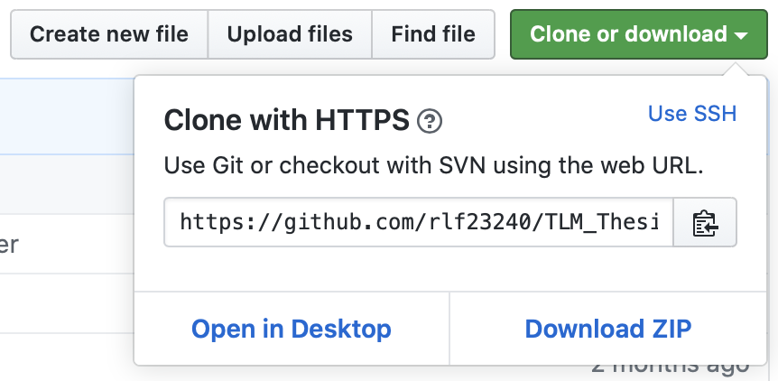
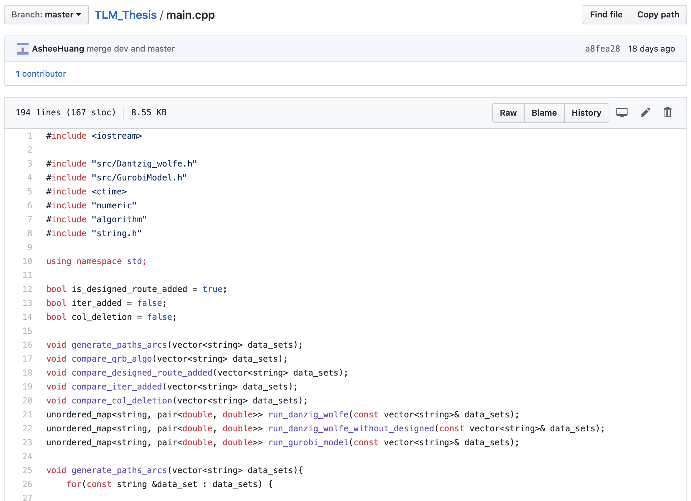
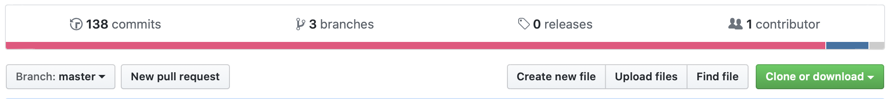
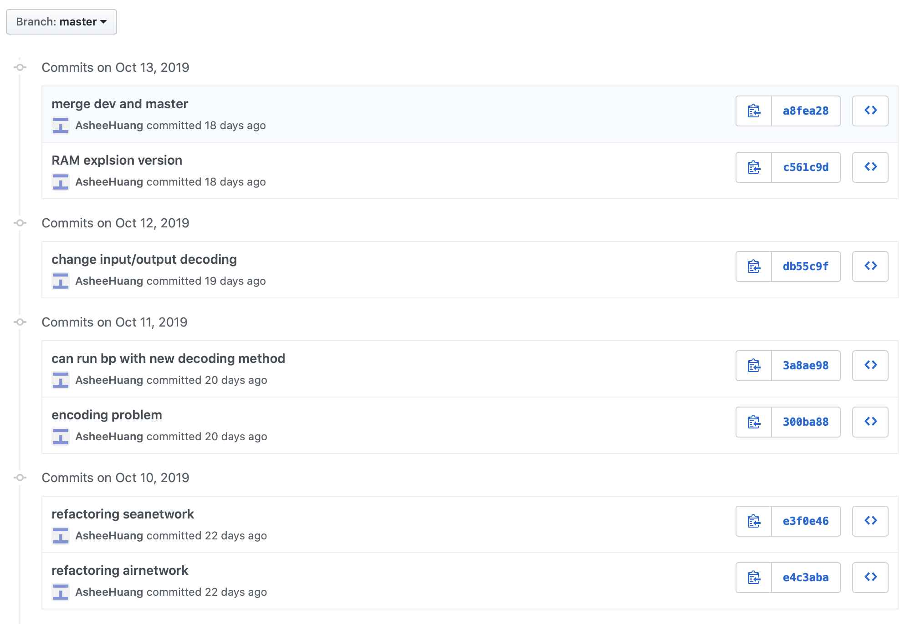

# 程式委託須知 ver0.999

## Part 0. 寫在前頭

本文是在聽聞程式委託以及協助方之間在確保品質以及高頻度的修改方面產生了各種摩擦，為了減少該問題的生成，以自身以及他人經驗總結而成。

本文分為兩部分，分別為給委託方（模型設計者）與給被委託方（程式撰寫者），並羅列出委託或是被委託所需要的注意事項，以減少對對方領域的不熟悉造成的後續的問題。每一項建議都有羅列出對應的原因，希望雙方能在理解的狀況下進行準備，以免偏離主旨。

本文僅僅只是作為建議，讓雙方能夠作為參考，並非絕對，有任何問題請隨時提出，也隨時歡迎修改本文以更符合需求。

## Part 1. 給委託方

### Check List
在您委託程式或是修改要求前，建議您確認：

1. 您的問題情境、數學模型
2. 演算法與其估計的複雜度
3. 資料的量與範圍
4. 一組完整的、手算的資料，用以檢查程式的問題
5. 與您的程式設計者確認後續修改的要求與範圍
6. 與您的程式設計者討論並確立進度追蹤的形式以及後續的時間規劃

建議在委託之前先詳閱這些建議，該建議在診斷程式的問題、驗證程式的可用性與減少溝通誤差方面有相當的影響，尤其是第五點，頻繁的修改在過去造成了相當多的問題，因此這些項目雖非必須，但請務必斟酌。

### 1. 模型
提供所處理模型之大綱，包括問題的情境及所轉換的數學模型類型，如最短路徑問題，動態規劃問題，若您的模型在委託時還未能明確，亦須說明模型之特徵。

請勿以「最佳化問題」一詞概括你的模型，也請勿將模型與演算法二詞混淆。模型所包含的是您所解決的問題及限制等等，而演算法則是您解決的方法，以簡單的應用問題為例，您對應問題所寫下的多元一次聯立方程式稱作您的數學模型，而演算法則可能是加減消去法或是利用行列式計算的克拉瑪公式。

此項要求目的在於判斷程式的難度與複雜度，確保雙方對問題皆有相當的認識。當程式的設計者能夠確實的理解您的問題時，將能夠作出較為靈活的判斷，像是在不影響您模型的數學架構的前提下推薦實務上較為有利的演算法或是修正，以及在程式撰寫的途中向您提出可能的缺陷等等。

### 2. 演算法
請詳細列出您所預期使用的演算法。若演算法有對應的名稱，如在路徑問題上常見的Dijkstra，您可以直接告知。但在大部分的情況下，您的演算法可能是某寫演算法的修改，或是自創的演算法並沒有對應的名稱，在這種情況下，可以參考以下的檢查表以供參考。

1. 您演算法的特徵，像是是否為隨機演算法、演算法是廣度或是深度優先等等您覺得需要注意的特徵。

2. 您演算法的Pseudocode或是流程圖等等，用以在程式撰寫期間作為參考。

3. 演算法的複雜度。若您不明白如何計算複雜度，請參考附錄所列出在路徑問題中常見的操作並標明操作的次數，若有不在列表中的可以直接向您的委託者請教。

4. *一組可以快速，可以重複驗證的資料，這樣的資料相當的重要，將在下文資料環節做說明，請審慎斟酌。*

### 3. 測試資料
以下兩點為建議準備您的測試資料時所需考慮的：

#### (i) 資料的範圍
請確認您模型參數的數字範圍，單筆資料的量以及數字範圍，是否有小數點等等。

資料的量可以用以估計計算的時間以及記憶體的用量，資料的數字範圍則會決定資料要用何種方式記錄在電腦中，不同種記錄方式有其範圍限制，以C/C++為例，在大部分的電腦中，變數範圍如下：

|型別名稱                |對應範圍                                     |支援小數點|
|:----------------------|:-----------------------------------------:|:--------|
|char                   |-128 ~ 127                                 |否       |
|int                    |-2.1x10^9 ~ 2.1x10^9                       |否       |
|unsigned int           |0 ~ 4.2x10^9                               |否       |
|float                  |-10^38 ~ -10^-38, 0, 10^-38 ~ 10^38        |是       |
|double                 |-10^308 ~ -10^-308, 0, 10^-308 ~ 10^308)   |是       |

請注意，在此謹羅列出數量級以供參考。

習慣上，若無特殊需求，整數資料使用int，小數點資料使用double。若您的資料範圍將會超出int或是double所能計算的範圍，請務必先行告知。

*請注意，在程式開發期間修改變數型別並不是一件簡單的事，根據所使用的語言而定，在某些情況下修改型別會導致程式中不同型別之間互相運算，這可能會導致預期外的結果，且視編譯器的設定，電腦不會做出任何警告。*

#### (ii) 驗證用的資料
建議您在委託之前先行準備好一組小的資料以利程式的驗證，這組資料必須用手算過一次，並附上完整的計算過程與結果，若您的演算法具有隨機的部分，也請隨意取一個隨機值進行計算，並標注您取的隨機值。

*請注意，使用Gurobi或任何程式、套裝軟體都不稱作「用手算過一次」。*

這筆資料的用途有以下兩點：

1. 用以確認輸入程式的資料格式，因此請認真排序你的資料。
2. 確認您的想法與程式設計者完全一致。

這筆資料的結果不能只是一個合理範圍，因為程式設計者將會預期自己的程式與這筆資料完完全全的一致。

在程式當中有無數種錯誤的方式產生合理的結果，在複雜的程式當中更是如此，當您只檢查結果是否合理時，這種錯誤將會被忽略。為了避免發生這種難以發現的錯誤，這種資料是必須的，因為這筆資料結果並非範圍，而是一個確切的數字，有任何與您預期中的演算法有任何的偏差，他將如實的反應到結果上。

附上計算過程的原因，則是為了快速的確認問題，有時程式的結果不一致，可能是來自電腦小數點的捨入誤差或是其他計算上的問題，為了分辨這些問題，計算過程也是必要的。

### 4. 電腦規格
請列出您使用電腦的規格、作業系統以及開發環境，情況允許的話可以附上程式的期望執行時間。

#### (i) 電腦規格
包括CPU規格以及記憶體等等。

請注意，可能並不如您所想，記憶體在某些情況下比您的CPU要更為重要，CPU會決定您程式要跑多久，但是記憶體將會決定您程式能不能平安無事地結束運行。

在一般常見的最佳化問題中，通常會存在迴圈不斷的改善您的結果直到終止條件達成為止，在每一次迴圈中，程式都會記錄一些資料，這些一次次不斷累積的資料在極端情況下將會填滿整個電腦的記憶體導致程式意外地結束運行，為避免這種情況，可以事先告知程式設計者記憶體的狀況以確實地管理記憶體。

#### (ii) 作業系統以及開發環境
常見的作業系統以及開發環境有以下幾種（以C/C++為例）：

Virtual Studio for Windows

Xcode for Mac

CLion for Windows, Mac and Linux

CodeBlocks for Windows, Mac and Linux

若能先行告知您所使用的作業系統以及開發環境，能讓程式設計者更快速地引導您部署他所撰寫的程式，提升效率。

若您在程式撰寫開始之前還未決定您所使用的開發環境，推薦您使用可以在多個平台運行的開發環境如CLion，這將可以減少程式設計者在部署他的程式時的問題。

#### (iii) 期望的執行時間
將這點列於此是因為執行時間除了與演算法有關外，與硬體也息息相關。實際執行時間在程式完成之前相當難以估計，因此當實際執行與期望有所落差時，請與您的程式設計者討論，確認問題是在演算法方面還是硬體方面，以規劃改進方向。

*請注意切勿將期望時間當作必須要達成的事項來約束您的程式設計者，這在您的演算法沒有被驗證前是相當無理的要求。*

### 5. 程式的修改
在一般的程式外包中，需要撰寫所謂的軟體規格說明書（Software Requirement Specification, SRS, 參考隨附的PDF文件），一但確認各項軟體規格後便在交件前不得修改，交貨後的追加需求將被視為獨立的案子，若強求對方進行修改將會造成不必要的摩擦。

但考慮到論文的形式，隨著研究的進展，新的想法或需求將會被加入到程式中，完全不得修改可能過於嚴格，*因此請與您的程式設計者詳談，務必確認您的程式設計者知悉且確實保留修改時間。*

在確認您的程式設計者理解之後，建議針對修改的形式做詳細的計畫，並注意以下幾點：

1. *在程式完成之前不提出任何修改。*
2. *在前一次修改尚未完成時不提出任何修改。*
3. *每一次修改時Check List當中的每一項務必全部重新檢查，包括資料重新手算，以及後續修改的協議是否需要修正。*

將您的新想法加入程式，在實作的層面上，往往會超出您想像的範圍，請務必向您的程式設計者確認實際的影響，否則將會造成工作量估計上的認知差異。

另外，在同一時間進行多數的修改也會造成程式設計者的大量困擾。不僅是測試資料不一致導致測試困難，許多看似無關的修改往往在程式上並不如您所想像的不相關。

最後，在某些情況下您的修改可能會被您的程式設計者認定為難以達成，這一般有以下兩種可能性：

1. 程式本身或是硬體方面的限制。
2. 修改層面過大或是被委託者有其他規劃導致您的程式設計者並無足夠的時間進行修改。

若為第一種情況，您可以與您的程式設計者討論，是否有其他替代方案。*但請注意並不是每一個問題都有合理的解決方案，請勿將其作為必須完成的事項要求您的程式設計者。*

若是第二種情況，*您必須儘早與您的程式設計者進行討論並完整交接給下一位撰寫者，並保留一段詢問時間給接手者，切勿拖延。*
否則在程式碼註解不足的情況下，這將會導致程式難以繼續撰寫。

### 6. 規格書與進度追蹤
考慮到委託之間以學生為主，並不要求撰寫規格書，但仍建議以上各點詳談之後以書面方式進行保存，並在每次修改與追加委託時能夠重新檢視。此外，因並非正式的規格，對書面資料的想法也較容易產生歧義，因此建議定期的追蹤進度。以下為具體的建議方案：

1. 與您的程式撰寫者協議，定期以見面或以視訊方式共同檢視程式狀態。
2. 若您的程式撰寫者使用Github，您可以藉由Github網頁定期檢視修改狀況（參考附錄）。

*請注意，請勿以自身不理解程式為由對程式碼不聞不問。*
若您自身並不理解程式，請在共同檢視程式碼的時間中對您的程式設計者進行詢問，並對各個區段的程式碼進行理解。這並不是希望您能理解每一行程式碼的詳細作用，而是對一段程式碼的大綱有所知悉。這麼做的理由主要有兩點：

您能在理解程式碼大致作用的情況下與您自身的想法做比對，以對雙方模型與演算法的理解作出即時的修正。

若您的程式遭遇特殊情況必須進行交接，您所理解的程式碼大綱，將對新委託者有莫大的幫助，尤其是在程式碼註解不足、前任撰寫者忙於他事的情況下。

### Extra. 複雜度
以下將羅列出一些操作的複雜度以供參考，在告知程式設計者時，請告知以下操作的使用次數、是否在迴圈當中等等資訊。

#### (i) 序列
|操作                    |複雜度   |備註                                      |
|:----------------------|:--------:|:--------------------------------------|
|路徑的插入與拔出          |O(n)      |使用link list能達到O(1)，但存取會受限.     |
|路徑的複製               |O(n)      |                                       |
|路徑的插入與拔出並比較原路徑|O(n)      |注意程式中這包含複製與插入拔出兩項操作        |
|排序                    |約O(nlogn)|使用Priority queue能自動排序，但插入拔出耗時|

#### (ii) 路網（圖論）
|操作                    |複雜度   |備註                                  |
|:----------------------|:--------:|:----------------------------------|
|將節點插入或移出路網中     |O(n)      |                                   |
|最短路徑                |約O(n+logn)|Dijkstra演算法，視限制條件而定，可能更慢|
|最小生成樹              |約O(nlogn)  |Kruskal演算法，但存在更快的演算法     |

#### (iii) 線性代數
|操作                    |複雜度   |備註                                  |
|:----------------------|:--------:|:----------------------------------|
|矩陣乘法                 |O(n^2.7)  |Strassen演算法，但存在更快的演算法    |
|解線性方程組             |O(n^3).   |高斯消去法                          |
|對角化、特徵值            |O(n^3)   |視矩陣特性可大幅加速                  |

### Extra. Github網頁版簡易說明
Github是用以追蹤程式碼修改與嘗試的方便工具，但在考慮到您並不一定具有相關的經驗，在此謹簡單說明網頁版的基礎功能。

在向您的程式設計者請求網址進入後，您應該能看到以下介面：

首先您應先在右上角向您的程式撰寫者確認分支（Branch），若沒有特殊狀況一般為master：

確認完畢後便可以點擊右上角的Clone or Download中的Download ZIP來進行打包下載：

您也可以點擊任意檔案檢視內容，並對右上方的Raw按鈕點擊右鍵選擇下載：

最後您可以點擊頁面上方橫條中的commits按鈕：

進入後您可以在這裡看見近期您的程式設計者所做的修改：

以上便是您可能會需要的功能，其他更詳細的功能請向您的程式設計者確認。

## Part 2. 給受委託方

### Check List
在您接受委託前或是程式修改前，建議您確認：

1. 第一部分的各項要點，您的委託者已確認完畢。
2. 確認問題的模型及演算法，以及大略的實作方式。
3. 確認後續修改與追加需求的協議，以及保留的修改時間。

首先在開始閱讀本部分之前，建議先閱讀第一部分，確認您的委託者有作出相應的準備。
以下幾點是與委託方溝通時的建議，以及程式相關的建議：

### 1. 程式的修改
因該委託的研究性質，程式的Specification可能會作出修正（詳情請參閱第一部分第五點），因此*請您務必確認您已知悉程式將會作出後續的修改，確實估算完成時間且追加修改的時間，並認同雙方對修改方面所做的協議。*
請務必審慎考慮在第一部分第五點中所羅列的建議並視情況進行追加。且當委託方提出追加需求時，請務必重新確認Check List中的每一項，以避免出現爭執。

### 2. 請預留您的時間
請在您認為可以完成的時間之後追加時間，尤其在當您有後續規劃時。該預留的時間除了除錯之外，也給予您在判斷要求不可完成時，交接給下一人的時間。*因此若您無法額外保留修改的時間，請盡快拒絕委託或修改。*

### 3. 向您的委託方解釋程式
在一般情況下，您的委託方並不瞭解程式，為了後續溝通的順暢，建議您可以定期與委託方見面或是進行視訊，向對方大略的解釋一個區段的程式碼大致在做什麼，以避免彼此認知的差異。

### 4. 程式的建議：關於後續修改
建議您善用物件導向以及設計模式，降低各個元件之間的相依性，避免程式完成後追加的修改需求影響層面過廣。

### 5. 程式的建議：關於記憶體
在現在的硬體規格下呼叫多餘的記憶體通常不會造成太大的問題，但請注意您的程式在處理大量資料時運行時間可能長達數天，當每次迴圈都造成記憶體洩漏時便有機會造成問題，而委託方要求的程式語言又大多是使用C/C++，請務必注意C/C++在記憶體管理上有其困難，以下是具體的建議：

1. 完整寫下您的Constructor以及Destructor，讓您追蹤物件的生成與釋放。

2. 注意您初始化物件是使用實體或是指標（new），並確認您複製物件時的行為。

3. 善用搜尋，檢查每一個new或malloc都有對應的delete或dealloc。

4. 陣列善用vector，讓vector物件對陣列的生成與釋放進行管理。

5. C++11標準中新增了自動記憶體管理（auto_ptr）以對應近代語言的垃圾回收機制，若情況允許，可以試著善用該功能取代new以及delete，簡化您的記憶體管理。

### 6. 程式的建議：關於讀取資料
在許多情況下，您的委託方交給您的測試資料會出現兩種不同的換行字元，在Linux系統或是程式自動產生的測試資料換行字元通常為\n，但委託方在Windows系統下手打的資料常會使用\r\n作為換行字元，當資料讀取出現問題時，可以先行檢查該問題。